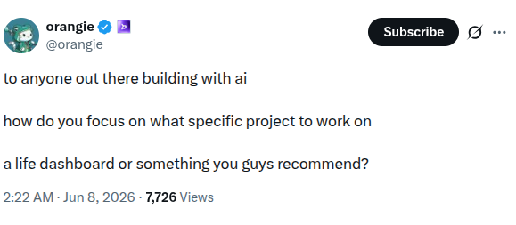
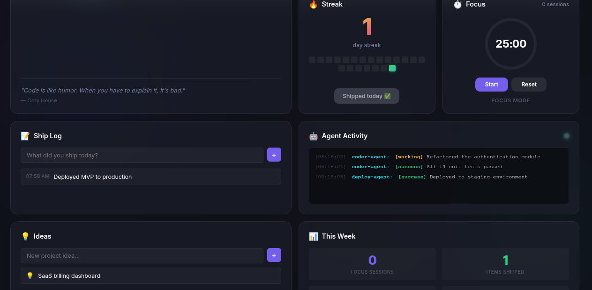
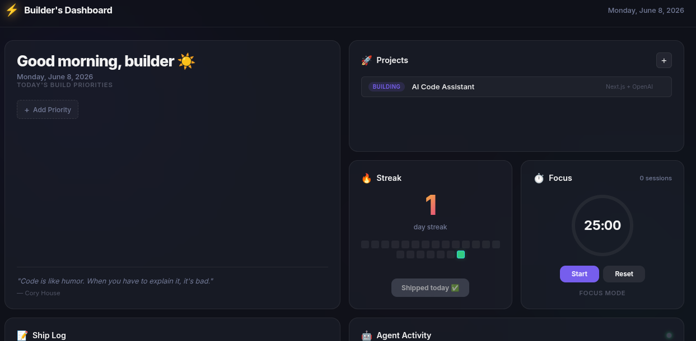

# Builder's Dashboard ⚡️

A premium, glassmorphism "Life OS" and command center designed specifically for builders, makers, and those shipping with AI agents. Track your projects, deep work sessions, shipping streaks, and let your AI agents report their progress directly to your dashboard in real-time.

> **Inspiration**: This project was inspired by a tweet from [@orangie](https://x.com/orangie/status/2063763483309576634?s=20) asking how builders building with AI focus on what projects to work on and manage a life dashboard.



## Screenshots




## Features 🚀

- **100% Local & Private**: No cloud databases. All personal data (goals, streaks, ship logs) is saved instantly to your browser's `localStorage`.
- **Zero Dependencies**: Pure HTML, CSS, and Vanilla JS. No build steps, no Node_modules. Just run it.
- **Glassmorphism Bento UI**: A beautiful dark-mode interface designed to be visually stunning, reducing cognitive load with a "Calm UX" approach.
- **Agent API Integration**: Includes a tiny Python server that acts as a local API webhook. External AI coding agents (like Claude Code, Aider, Cursor) can `POST` their progress logs, which instantly appear in the dashboard's scrolling terminal feed.
- **7 Core Modules**:
  1. **Daily Focus**: Top priorities and motivational builder quotes.
  2. **Projects Kanban**: Track active projects (Ideating → Building → Shipped).
  3. **Build Streak Heatmap**: A GitHub-style 21-day heatmap tracking your shipping velocity.
  4. **Focus Timer**: A 25/5 Pomodoro timer built with pure SVG animations.
  5. **Ship Log**: A daily micro-journal logging what you deployed.
  6. **Ideas Backlog**: Capture ideas and promote them to projects with one click.
  7. **Agent Activity**: Real-time terminal feed of your AI agents working in the background.

## How to Run Locally 💻

You can run this dashboard simply by opening `index.html` in your browser. However, **to enable the real-time AI Agent Activity feed**, you should run the included Python server.

1. Clone the repository:
   ```bash
   git clone https://github.com/brn-maker/builder-s-dashboard.git
   cd builder-s-dashboard
   ```
2. Start the local Python API server:
   ```bash
   python3 server.py
   ```
3. Open your browser and navigate to:
   ```
   http://localhost:8080
   ```

## Integrating Your AI Agents 🤖

Because the dashboard runs a local API on port `8080`, your AI coding agents can easily report their progress to the dashboard's terminal feed. 

Whenever an agent finishes a task, hits an error, or makes a deployment, simply have it send an HTTP POST request to `/api/agent`.

### cURL Example
Drop this into an automated script or tell your CLI agent (like Claude Code) to execute it:
```bash
curl -X POST http://localhost:8080/api/agent \
     -H "Content-Type: application/json" \
     -d '{
           "agent": "coder-agent", 
           "message": "Refactored the authentication module", 
           "status": "success"
         }'
```

### Python Example
If you're building a custom LangChain or AutoGen agent:
```python
import requests

def report_to_dashboard(agent_name, message, status="info"):
    try:
        requests.post("http://localhost:8080/api/agent", json={
            "agent": agent_name,
            "message": message,
            "status": status # options: 'success', 'error', 'working', 'info'
        })
    except:
        pass # Ignore if dashboard isn't running
```

### Agent Configuration Prompt
To get CLI agents like **Claude Code** or **Aider** to report to the dashboard, just add this to your custom instructions or prompt:
> *"Whenever you successfully complete a coding task, fix a bug, or make a commit, you MUST run this command in the terminal to report your progress: `curl -X POST http://localhost:8080/api/agent -H "Content-Type: application/json" -d '{"agent": "my-ai-agent", "message": "<brief summary of what you did>", "status": "success"}'`"*

## License
MIT License. Feel free to fork, vibe code, and build upon this to create your ultimate personal command center!
